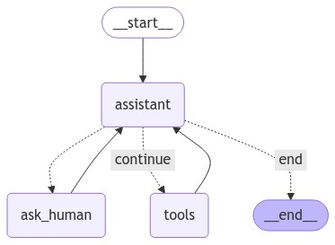

# langforge-os


[](https://github.com/micvitc/langforge-os/actions/workflows/ci.yml)

## A Natural Language Interface to Your OS

Based on **LangGraph**, this tool is **backend agnostic** and allows you to control OS functionality using **natural language**.

## Main Features



Current functionality includes:
- Human in the Loop
- Ability to check system information
- Run Python scripts
- Execute Bash commands

## Installation

Currently, only Linux is supported.

1. Clone the repository:
    ```bash
    git clone https://github.com/micvitc/langforge-os.git
    ```

2. Install dependencies:

    This project can use any OpenAI-compatible endpoint. We recommend using Ollama.

    - Install [Ollama](https://ollama.com/download) and download a model with tool-calling functionality.
    - Install at least [Python 3.12](https://www.python.org/downloads/release/python-3120/).

    Using Poetry:
    ```bash
    poetry install
    ```

    Or using `requirements.txt`:
    ```bash
    pip install -r requirements.txt
    ```

3. Start the application:
    ```bash
    python main.py
    ```

    It will ask you for a model name, base URL, and API key initially. In case you are using Ollama, this should be the config:
    
    ```yaml
    model_name: <model_name>
    base_url: http://localhost:11434/v1
    api_key: ollama
    ```

    You can check the available models using:

    ```bash
    ollama serve
    ```

    The model name and other details can be changed later in `config.yaml`.

## License

[MIT](https://github.com/micvitc/langforge-os/blob/main/LICENSE)

---


